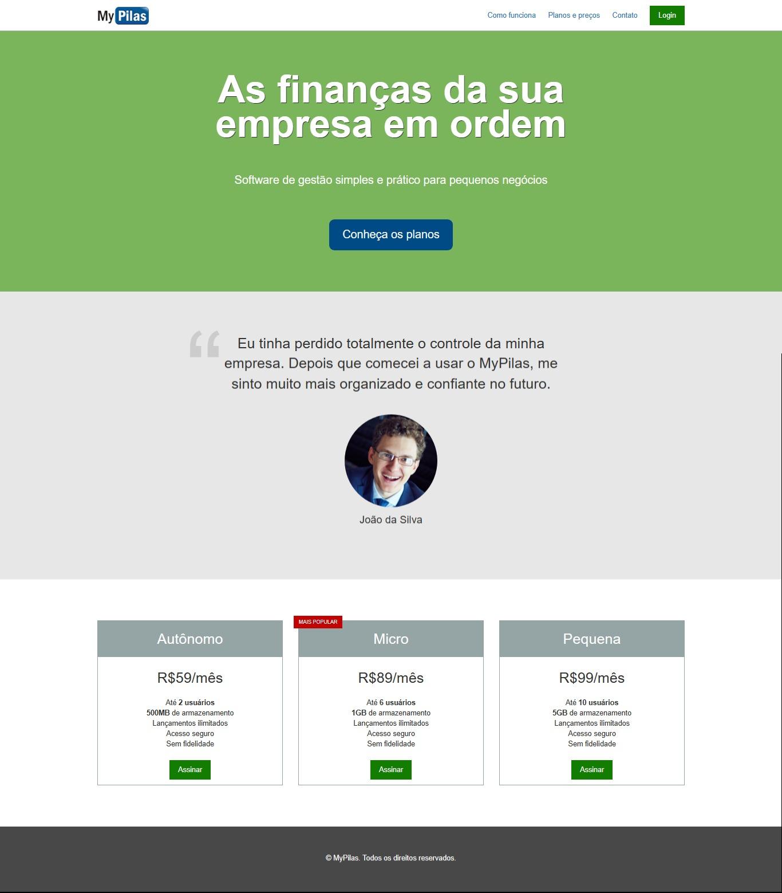
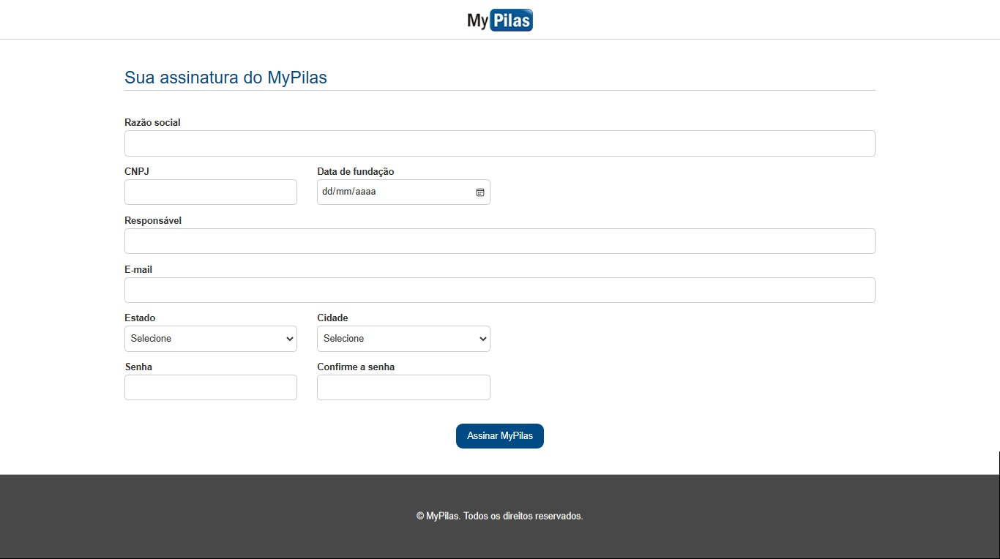

<h1 align="center"> My Pilas </h1>

Desenvolvimento de página web de software de gestão para pequenas empresas.

  

 

  
  

 

## 🚀 Tecnologias

Esse projeto foi desenvolvido com as seguintes tecnologias:

- HTML 5 ( `Metodologia BEM` )
- CSS 3
- Javascript

 

## 📝 License

Esse projeto está sob a licença MIT.

---

Feito por Ciro Batista da Silva
